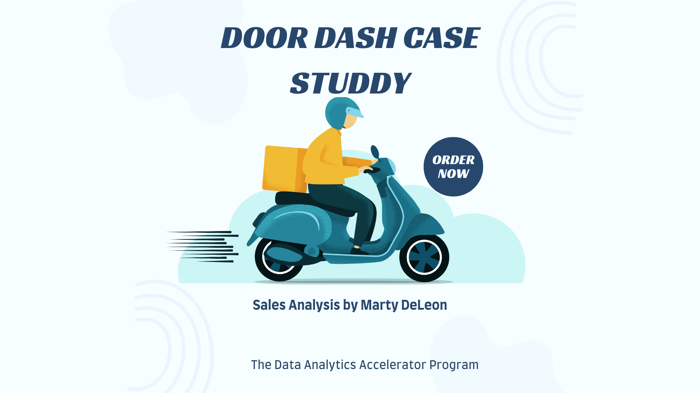

---

### Welcome to My Projects

#### [Door Dash Project](/bank)
<!--For this project I used Excel. Excel tools shown are functions (COUNT, MAX, AVERAGE, SUM, MIN). Scatter plots, histograms, advanced if-then formulas, pivot tables, and VLOOKUPs. This was my first time using Excel and I can see why it is still used as a data visualization tool.-->
<!---->

---
#### [Linked File Project](/files/Day 12 - 21 days to data.pdf)

For this project, I explored what a good analytics PowerPoint presentation should entail. It talks about main talking points, how to tie data to the business value, and much more. 

---
#### [External Link Project](https://www.linkedin.com/pulse/what-i-learned-21-days-data-avery-smith)

My final write up for Avery Smith's 21 Days To Data project covering New York City crime data. 

---
#### [Education Project](https://www.linkedin.com/pulse/massachusetts-education-analysis-samantha-paul/)

In this case study from Data Analytics Accelerator, I was prompted to analyze the State of Massachusetts education data. The main focuses were:
What schools are struggling the most?
How does class size affect college admission?
What are the top math schools in the state? 

---

### Category Name 2

- [Project 1 Title](http://example.com/)
- [Project 2 Title](http://example.com/)
- [Project 3 Title](http://example.com/)
- [Project 4 Title](http://example.com/)
- [Project 5 Title](http://example.com/)

---

